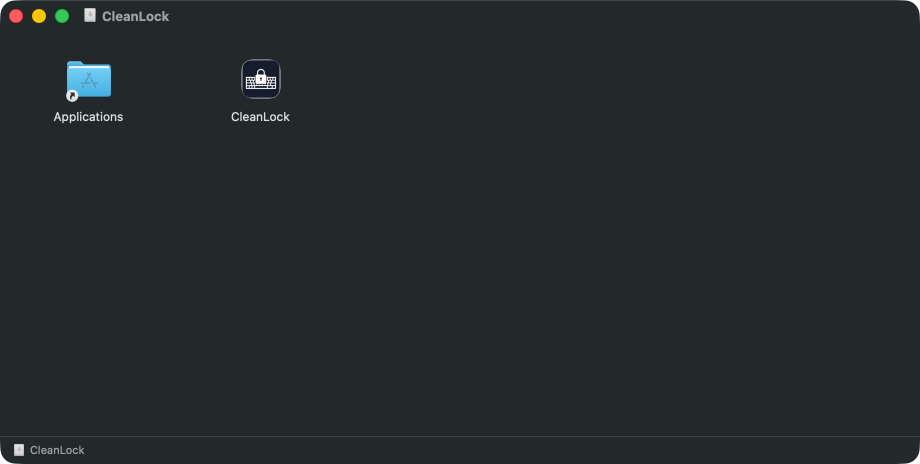
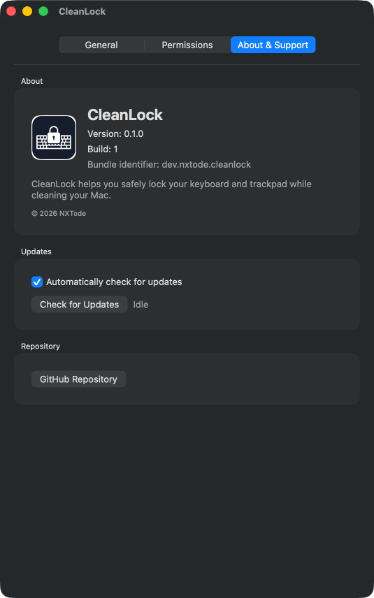
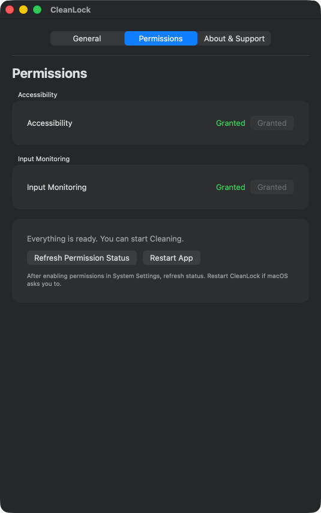
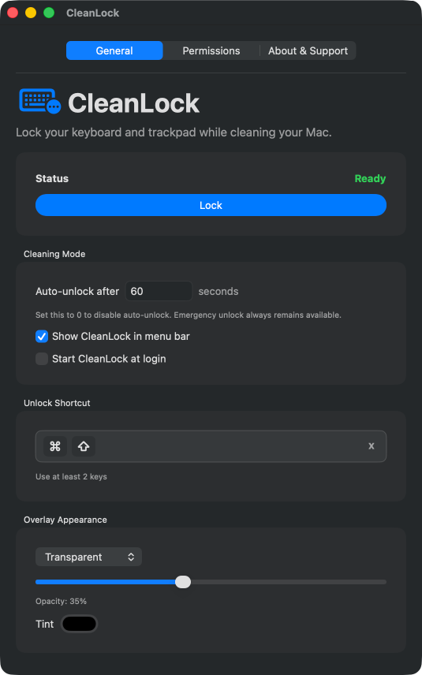

# CleanLock

Lock your keyboard and trackpad while cleaning your Mac.

[](https://support.apple.com/macos)
[](https://github.com/nxtode/CleanLock/releases/latest)
[](LICENSE)

**Download:** [CleanLock-latest.dmg](https://github.com/nxtode/CleanLock/releases/latest/download/CleanLock-latest.dmg)  
**Alternative ZIP:** [CleanLock-latest.zip](https://github.com/nxtode/CleanLock/releases/latest/download/CleanLock-latest.zip)

## Preview






## Overview

CleanLock is a native macOS utility that starts a temporary Cleaning Mode, blocks input, and shows a full-screen overlay so you can wipe down your keyboard and trackpad without accidental typing, clicks, scrolling, or media-key presses.

## Features

- Native macOS app window with General, Permissions, and About & Support tabs.
- Persistent menu bar icon that can stay available after the main app quits.
- Compact unlock shortcut recorder with reset-to-default support.
- Auto-unlock duration, including `0` to disable auto-unlock.
- Overlay styles: Default, Transparent with opacity and tint, and Custom Image.
- Start at Login.
- In-app update checks and installs through Sparkle.
- GitHub Releases fallback update checks.
- Accessibility and Input Monitoring permission detection.

## System Requirements

- macOS 13 Ventura or later.
- Accessibility permission.
- Input Monitoring permission.

## Installation

1. Download [CleanLock-latest.dmg](https://github.com/nxtode/CleanLock/releases/latest/download/CleanLock-latest.dmg) from the official release page.
2. Open the DMG.
3. Drag `CleanLock.app` into Applications.
4. Open CleanLock.
5. Go to the Permissions tab and enable the required macOS permissions.

The current public build is not yet Developer ID signed or notarized, so macOS may show a security warning.

## Required Permissions

CleanLock needs two macOS privacy permissions:

- Accessibility: needed to control and block input.
- Input Monitoring: needed to observe and intercept keyboard/input events.

macOS requires manual approval for Accessibility and Input Monitoring. CleanLock cannot automatically grant these permissions during installation. The app opens the correct System Settings pages, can refresh permission status, and includes a Restart App action for cases where macOS requires a restart after approval.

## Privacy

CleanLock does not record, store, or transmit keystrokes, mouse input, screen contents, or personal data. Input access is used only to temporarily block local keyboard, mouse, trackpad, and supported media-key events during Cleaning Mode.

CleanLock does not include analytics, telemetry, or remote tracking.

## Trust & Official Releases

The official repository is:

```text
https://github.com/nxtode/CleanLock
```

Official releases are published only at:

```text
https://github.com/nxtode/CleanLock/releases/latest
```

Recommended download:

```text
https://github.com/nxtode/CleanLock/releases/latest/download/CleanLock-latest.dmg
```

Alternative ZIP:

```text
https://github.com/nxtode/CleanLock/releases/latest/download/CleanLock-latest.zip
```

Only install CleanLock from the official GitHub Releases page unless you trust and have reviewed the source of a fork. Modified versions should clearly disclose their source code and license terms as required by the AGPL.

Because CleanLock requires sensitive macOS permissions, users should only install builds from sources they trust. The official CleanLock builds are published from the NXTode repository. Forks and modified versions should be reviewed before installation.

CleanLock protects menu bar commands with a local command token shared between its bundled main app, menu bar agent, and login helper. Release packages are built from release artifacts, and packaging verifies bundle identifiers, Sparkle metadata, helper apps, and top-level ZIP structure before artifacts are produced.

## Usage

1. Open CleanLock.
2. Configure General, Permissions, and About & Support.
3. Click Lock.
4. Clean your keyboard and trackpad.
5. Use the configured emergency shortcut to exit Cleaning Mode.

CleanLock can stay available in the menu bar even when the main app window is closed or the main app is quit. Use menu bar > Preferences to reopen CleanLock settings, or menu bar > Lock to start Cleaning Mode.

To fully exit CleanLock and remove the menu bar icon, choose menu bar > Quit.

## Default Shortcut

The default unlock shortcut is Left Command + Right Command, displayed as:

```text
⌘ ⌘
```

Click the shortcut field to start recording immediately. Press Escape or click outside the field to cancel. Custom shortcuts show a small `x` reset control; the default shortcut does not.

## Overlay Styles

- Default: a clean black overlay.
- Transparent: a tinted overlay with adjustable opacity that lets you keep watching the screen while input is locked.
- Custom Image: choose an image to use as the overlay background.

Custom images are copied into `Application Support/CleanLock` so the overlay can still load them if the original file moves. If a custom image is missing or unreadable, CleanLock falls back safely to the default overlay.

## Updates

The first install is via DMG. Future updates can be installed through CleanLock using Sparkle from About & Support > Check for Updates.

Sparkle appcast:

```text
https://nxtode.github.io/CleanLock/appcast.xml
```

GitHub Releases host the release assets:

- DMG: first install and manual installation.
- ZIP: Sparkle update asset and release fallback download.

The Sparkle private key is stored in the macOS Keychain by Sparkle tooling. Never commit private Sparkle keys. Only the public `SUPublicEDKey` belongs in the app bundle metadata.

## Start at Login

Start at Login starts the menu bar agent only. The main CleanLock window does not open at login. Use the menu bar icon to open CleanLock when you need the full app window.

## Uninstall

1. Quit CleanLock.
2. Delete `CleanLock.app` from Applications.
3. Remove CleanLock from Accessibility and Input Monitoring in System Settings.

## Build from Source

```sh
swift build
./script/build_and_run.sh --verify
```

## Release Process

```sh
swift build
./script/build_and_run.sh --verify
./script/package_release.sh
./script/sparkle_generate_appcast.sh
```

Generate a Sparkle key when setting up a new signing identity:

```sh
./script/sparkle_generate_keys.sh
```

Save only the printed public `SUPublicEDKey` in `Resources/SparklePublicEDKey.txt`.

`script/package_release.sh` creates release artifacts in `dist/`:

- `dist/CleanLock.app`
- `dist/CleanLock-v0.1.4.zip`
- `dist/CleanLock-v0.1.4.dmg`
- `dist/CleanLock-latest.zip`
- `dist/CleanLock-latest.dmg`

Release packaging builds with `swift build -c release` and stages the release executables.

`script/sparkle_generate_appcast.sh` writes:

- `docs/appcast.xml`

Publish GitHub Pages from the `main` branch and `/docs` folder so the appcast is available at the Sparkle URL.

## Known Limitations

- macOS requires manual Accessibility and Input Monitoring approval.
- Some media, brightness, Caps Lock, or hardware-level keys may be handled by macOS before apps can intercept them.
- Caps Lock is blocked while the event tap receives it, and CleanLock attempts to restore the original state afterward, but some keyboards may apply Caps Lock below the app event layer.
- Cursor movement is disassociated from the mouse/trackpad during Cleaning Mode and restored when Cleaning Mode stops.
- The current public build is not yet Developer ID signed or notarized, so macOS may show a security warning.
- Signing and notarization are recommended for future release hardening.
- Permissions may require quitting and reopening CleanLock after approval.
- CleanLock is intended for brief cleaning sessions, not as a security lock.

## Security

If you believe you found a security or privacy issue, please open a GitHub issue with enough detail to reproduce the problem. Avoid sharing sensitive personal information in public issues.

Report issues at:

```text
https://github.com/nxtode/CleanLock/issues
```

## License

CleanLock is licensed under the GNU Affero General Public License v3.0 or later.

You may use, study, modify, distribute, and sell copies of CleanLock, provided that any distributed modified version remains licensed under the AGPL and includes the corresponding source code. If you modify CleanLock and make it available for users to interact with over a network, the AGPL also requires that users be able to access the corresponding source code.

See [LICENSE](LICENSE) for the full license text.
